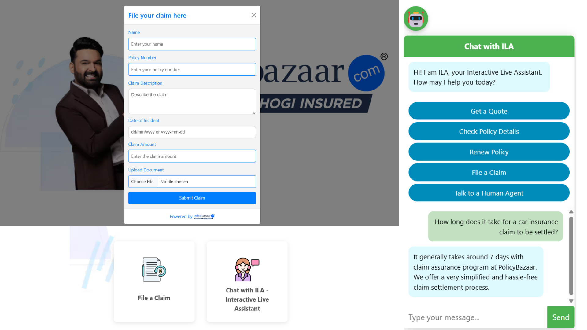

# Hi! I am ILA 🤖, your Interactive Live Assistant for all your policy needs at PolicyBazaar 

I am an AI-powered tool developed to enhance customer experience by automating common queries, streamlining the claim-filing process, and reducing errors. I was created in response to PolicyBazaar's challenge at Google’s Gen AI Exchange Hackathon, leveraging state-of-the-art capablities of Gemini to simplify insurance processes, improve claim accuracy, and make insurance more accessible.

# Want to meet 🤝

But I think we should get to know each other a bit more. Let's start from me.<br>


I am built on React frontend and a Node.js backend. There are two primary components:<br>
* main (frontend interface)
* backend (server)<br> 

## Directory Structure

```plaintext

├── backend
│   ├── server.js          
│   ├── package.json       
├── main
│   ├── src
│   │   ├── components
│   │   │   ├── ChatBot.js  
│   │   │   ├── ClaimForm.js 
│   │   ├── App.js
│   │   ├── index.js
│   ├── public
│   │   ├── index.html
│   ├── package.json      
```

## Now, follow the instructions below to call me on your machine.

## Prerequisites

Make sure you have the following installed on your system:

- [Node.js](https://nodejs.org/) (v14.x or later)
- [npm](https://www.npmjs.com/) (v6.x or later)


## Cloning the Repository

Clone the repository to your local machine using the following command and Navigate to the project directory:

   
```bash
   git clone https://github.com/kkschauhan/GenAIGoogle_PolicyBazaar.git
   cd GenAIGoogle_PolicyBazaar
```

## Installing Dependencies

### Frontend (Main)
Navigate to the `main` directory and Install the required dependencies:

   ```bash
   cd main
   npm install
   ```
### Backend
Navigate to the `main` directory and Install the required dependencies:

   ```bash
   cd ../backend
   npm install
   ```

## Running the Application

### Starting the Backend Server

In the `backend` directory, start the server using the following command:

   ```bash
   cd backend
   node server.js
   ```
The server will start at http://localhost:5000.

### Running Main Interface
In a new terminal window, navigate to the 'main' directory and start the application:

   ```bash
   cd main
   npm start
   ```
The server will start at http://localhost:3000.


# What do I solve for us?

- Complex insurance forms and processes that frustrate customers.
- High error rates in manual form filling, delaying claim approvals.
- Time-consuming customer queries that overload support teams.
- Overwhelming navigation of insurance policies and terms.

## How do I help?

I address these challenges by integrating Gemini and OCR to automate claim filing procedure, simplify insurance process, and reduce errors. I also help with a more convinient and streramlined chat-support using a Gen-AI powered chatbot built exclusively for PolicyBazaar.com


### Key Features

#### Gen AI Query Resolution
- A large language model (LLM) responds to routine customer queries, while complex cases are handled by human agents with <b>well reseaerched prompt-engineering</b> to set the context of conversation in line with PolicyBazaar.

#### AI-Assisted Form Filling
- Utilizes Gen AI models to guide users through form filling, <b>reducing errors with real-time validation.</b>

#### OCR for Document Processing
- Tesseract.js extracts text from uploaded documents and <b>auto-populates form fields and checks for consistency</b> to reduce potential errors.

#### Simplified Claim Filing
- ILA ensures all required documents and data are validated, <b>improving claim approval rates.</b>

#### Interactive UI
- Simple yet effective UI for <b>intuitive and seamless customer experience</b> built with design principles to serve users from diverse segments in context of their capablity to adapt to new technologies.


## Here is a snapshot!

## Primary Technology Stack

- **Google AI Studio**: To handle Gemini AI based project.
- **Gemini AI**: LLM-powered query handling and form validation.
- **Tesseract.js**: Extracts text from uploaded documents for automatic form population.
- **React.js**: Provides an interactive, responsive UI for form filling, document upload, and query resolution.
- **Node.js with Express**: Manages server-side logic, data validation, and API integration.


## Potential Impact

### For Customers:
- Faster and error-free claim submissions with real-time validation.
- A simplified, step-by-step form-filling process that reduces confusion.
- More seamless Gen-AI powered chat-support 

### For PolicyBazaar.com:
- Reduced claim processing time through automated document handling.
- Increased claim acceptance rates due to reduced errors.
- Cost reduction with Automated chat-support and Validation capablities.

## Challenges Addressed
- **Complex Insurance Jargon**: Simplified policy details for users through Gen AI models.
- **Real-Time Validation**: Achieved instant error detection and correction during form submission using Gen AI.
- **Setting the COntext**: Researched on the important factors for designing prompts to align Gen-AI based chat-suppost to PolicyBazaar for a more customized and effective experience
- **Document Diversity**: Handled various document formats using Tesseract.js for precise extraction.

## Future Scope
- **Multi-language Support**: Expansion to support multiple languages for a broader user base.
- **Enhanced AI Recommendations**: Utilizing Gen AI for personalized insurance policy suggestions.
- **Advanced Analytics**: Offering insights into customer behavior and claim trends.


## 🚀 Thank You for Exploring!

We’re not just redefining accessibility and trust; we’re making insurance simple, transparent, and engaging. Join us in revolutionizing the insurance experience—because everyone deserves peace of mind! 🌟

<span style="font-size: 1.30em;">📚</span> Additonal Docs:

- [Explainer](https://drive.google.com/file/d/1x6_2D3wrgnYSNE7F7lltt61Y6E-GiIhs/view?usp=sharing)
- [User Journey Map](https://drive.google.com/file/d/1TAPAYvgv2eM_G_qAicI6VrG2EsHu4j6J/view?usp=sharing)
- [Demo]([https://drive.google.com/file/d/1TAPAYvgv2eM_G_qAicI6VrG2EsHu4j6J/view?usp=sharing](https://drive.google.com/file/d/1uaGle2euqHXnXtEMS1mwWqF0FN02qEb_/view?usp=sharing))


Feel free to explore, contribute, and connect. Let’s make insurance work for everyone!

### 🌐 Connect with Us:
- [Shreya Garg](https://www.linkedin.com/in/shreyaxgarg/)
- [Kshitij Kumar Singh Chauhan](https://www.linkedin.com/in/kkschauhan/)

